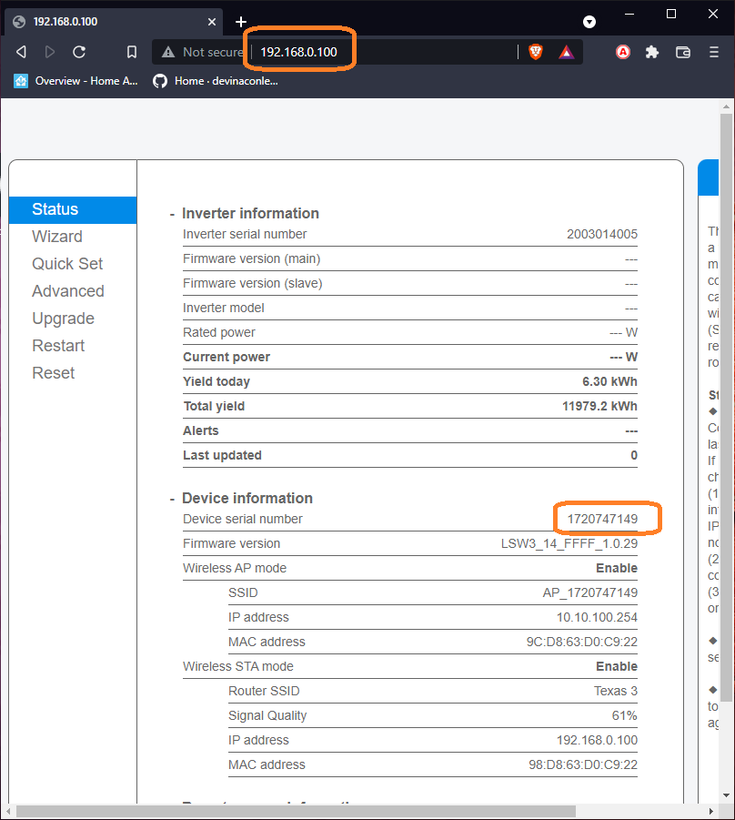
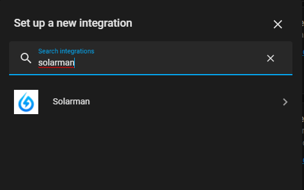
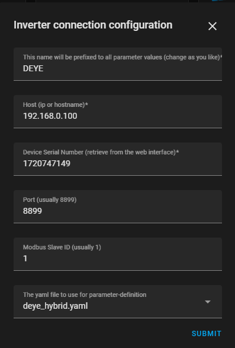
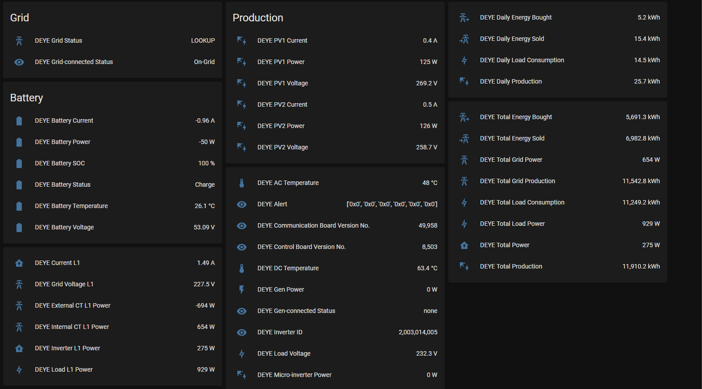
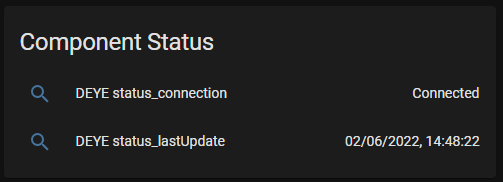

# Solarman integration

Home Assistant component for interacting with Solarman data collectors used with a variety of inverters. The integration allows Home Assistant to connect in direct-mode over the local network to the collector to extract the information, and no cables are required.

It has been created with a 5kW DEYE/SUNSYNK inverter and since integrated with a variety of other inverters that uses the Solarman data collector.

This component uses Pysolarman by Jonathan McCrohan for the underlying protocol, and also provides service-access to the library for advanced users. See [advanced](advanced.md).

# Discord

Feel free to discuss the integration by joining the [Discord server](https://discord.gg/3HQJXR7qRd).

# Installation

## HACS

This method is prefered.

## Manual

For this, it is highly recomended to use the "Samba share" add-on (you will need to enable advanced mode in your user profile).

Clone or download the repo, and copy the "solarman" folder in "custom_components" to the "custom_components" folder in home assistant.

After that, the folder structure should look as follows:

```bash
custom_components
├── solarman
│   ├── __init__.py
│   ├── const.py
│   ├── manifest.json
│   ├── parser.py
│   ├── solarman.py
│   ├── sensor.py
│   └── inverter_definitions
│       ├── {inverter-definition yaml files}
├── {other components}
```

# Preparation

1. Get the IP and Serial Number to use in the configuration.

Find the internal IP of the logger on the DHCP server, and then open a browser and navigate to that address. If you are prompted for a username/password, use "admin" as username and "admin" as password.

Once logged in, expand the "Device information" and note the Device serial number, as well as the IP used.



2. Check the version of the solarman logger. If the serial number starts with 17xxxxxxx, 21xxxxxxx or 40xxxxxxx (protocol V5), the component should work. If not, you may need to try the component for V4 of the protocol mentioned above.

3. On your DHCP server, reserve the IP for the WiFi data logger so that it will not change.

# Configuration

This integration can be configured using config-flow, or by manually configuring using the configuration.yaml file. Both methods are described below:

## Automatic (config flow)

1. After the installation of this component, click on the "Configuration" tab on the left, then on "Devices & Services".
2. Select the "Integrations" tab on the top of the screen, then on the "+ ADD INTEGRATION" button on the left-hand corner.
3. Select the solarman integration.
   

4.Configure the entity by filling in the details.


## Manual Configuration (configuration.yaml)

In your configuration.yaml file, add the solarman platform under "sensor".

### Example:

```YAML

sensor:
  - platform: solarman
    name: DEYE
    inverter_host: 192.168.0.100
    inverter_port: 8899
    inverter_serial: 1720747149
    inverter_mb_slaveid: 1
    lookup_file: deye_hybrid.yaml
```

## Parameters

| Parameter           | Description                                                             |
| ------------------- | ----------------------------------------------------------------------- |
| name                | This name will be prefixed to all parameter values (change as you like) |
| inverter_host       | The IP address of the data logger. (\* see: autodiscover)               |
| inverter_port       | Always 8899                                                             |
| inverter_serial     | The serial number of the data collector (\* see: autodiscover)          |
| inverter_mb_slaveid | The Modbus Slave ID of the inverter. Defaults to 1                      |
| scan_interval       | Time in seconds between refresh intervals                               |
| lookup_file         | \*\* The yaml file to use for parameter-definition                      |

\*\* This parameter is optional, and if not specified will revert to deye_hybrid.yaml. If you customize the parameters, create a lookup file "custom_parameters.yaml" and refer to it so that it will not be overwritten during updates.

### Lookup Files

| Lookup File             | Inverters supported                      | Notes                                                            |
| ----------------------- | ---------------------------------------- | ---------------------------------------------------------------- |
| deye_hybrid.yaml        | DEYE/Sunsynk/SolArk Hybrid inverters     | used when no lookup specified                                    |
| deye_sg04lp3.yaml       | DEYE/Sunsynk/SolArk Hybrid 8/12K-SG04LP3 | e.g. 12K-SG04LP3-EU                                              |
| deye_string.yaml        | DEYE/Sunsynk/SolArk String inverters     | e.g. SUN-4/5/6/7/8/10/12K-G03 Plus                               |
| deye_2mppt.yaml         | DEYE Microinverter with 2 MPPT Trackers  | e.g. SUN600G3-EU-230 / SUN800G3-EU-230 / SUN1000G3-EU-230        |
| deye_4mppt.yaml         | DEYE Microinverter with 4 MPPT Trackers  | e.g. SUN1300G3-EU-230 / SUN1600G3-EU-230 / SUN2000G3-EU-230      |
| sofar_lsw3.yaml         | SOFAR Inverters                          |                                                                  |
| sofar_g3hyd.yaml        | SOFAR Hybrid Three-Phase inverter        | HYD 6000 or rebranded (three-phase), ex. ZCS Azzurro 3PH HYD-ZSS |
| sofar_hyd3k-6k.yaml     | SOFAR Hybrid Single-Phase inverter       | HYD 6000 or rebranded (single-phase), ex. ZCS Azzurro HYD-ZSS    |
| solis_hybrid.yaml       | SOLIS Hybrid inverter                    |                                                                  |
| solid_1p8k-5g.yaml      | SOLIS 1P8K-5G                            |                                                                  |
| zcs_azzurro-ktl-v3.yaml | ZCS Azzurro KTL-V3 inverters             | ZCS Azzurro 3.3/4.4/5.5/6.6 KTL-V3 (rebranded Sofar KTLX-G3)     |

# Auto-discovery

The component has the option to auto-discover the logger IP and serial number.

To use auto discovery, the IP should be specified as 0.0.0.0 and/or the serial as 0.

NOTE:
This should be used as a temporary or debug measure since the discovery only happens when the component starts and, if the logger is inaccessible at that point, the entities will unavailable until restart. This will not be the case when the IP and serial number were specified.

## Manual

The section below shows an example configuration done using manual configuration. This is an option for those that want to customize the component for inverters not supported out of the box.

```YAML

sensor:
  - platform: solarman
    name: DEYE
    inverter_host: 0.0.0.0
    inverter_port: 8899
    inverter_serial: 0
    inverter_mb_slaveid: 1
    lookup_file: deye_hybrid.yaml
```

## Config-flow


# Entities

Once the component is running, it will add the following entities to Home Assistant.


# Status Entities

Apart from the inverter-parameters, it will also add status entities to view the status of the solarman component (in the **Diagnostic** category).


# Energy Dashboard

The entities includes the device classes to enable it to be added to the [Energy Dashboard](https://www.home-assistant.io/blog/2021/08/04/home-energy-management/) introduced with Home Assistant Core 2021.8.

To configure the energy dashboard with the infirmation provided by this component, see [configuring energy dashboard](energy.md).

# Customization

This integration was tested against the DEYE 5kW inverter, and it is possible that the parameter-definitions for other inverters may differ. If you want to try your hand at it, refer to [customizing parameters.yaml](customization.md)/
