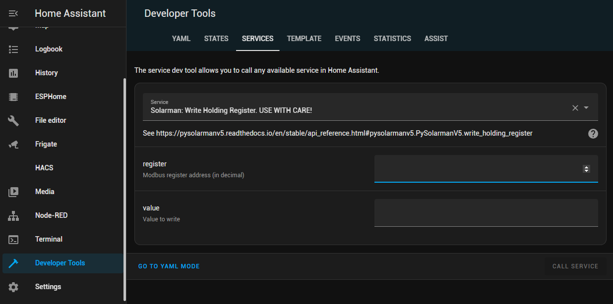

# Service Calls
The service calls allow you to invoke pysolarman in order to write to the inverter. This may be used to set the charge-mode from an automation.

Refer to [pysolarman](https://pysolarmanv5.readthedocs.io/en/stable/api_reference.html) for more information.

The only method exposes currently is "write_holding_register" and may be expanded in future.

This service will use the IP Address as well as serial number configured

**WARNING** Writing incorrect values to the inverted may cause damage to it. So please proceed with caution.

## Debugging
Click on "Developer Tools" on the left-hand, and then select "Services" at the top of the window.

Enter the register address as well as the value to write.  

