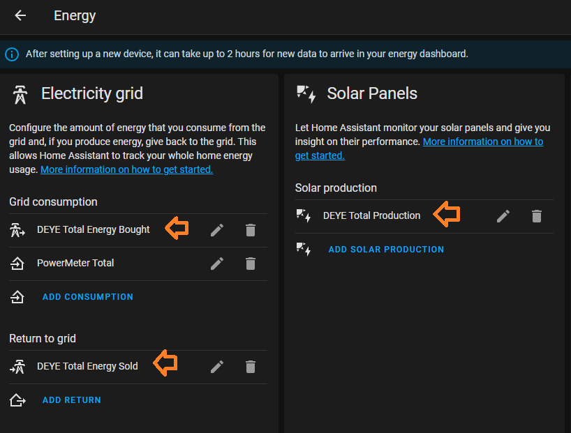
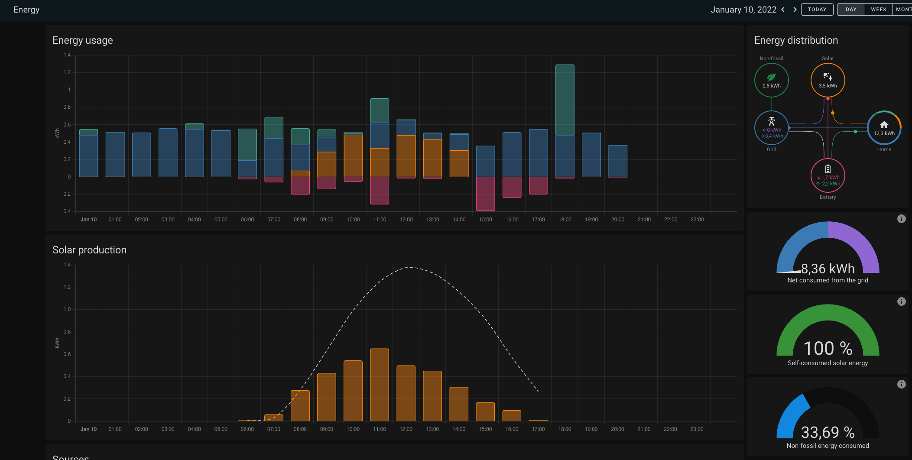

# Configure Energy Dashboard
The [Energy Dashboard](https://www.home-assistant.io/blog/2021/08/04/home-energy-management/) introduced with Home Assistant Core 2021.8 provides most of the functionality to create an awesome dashboard, and you only need to configure the correct inputs for it to start collecting data.

**Tip:** 
*Verify that the time is correctly set on the inverter so that the cumilative totals are reset at midnight.*

**Tip:**
*You can include induvidual energy cards on your Lovelace Dashboard [see here](https://www.home-assistant.io/lovelace/energy/)* 

## Configuration
Click on "Configuration" and select "Energy". 

| Parameter | Select Field |
| -- | --|
| Consumption| * XYZ Daily Energy Bought |
| Return to Grid| * XYZ Daily Energy Sold |
| Solar Production | * XYZ Daily Production |

* Replace XYZ with the name you specified in the configuration.yaml file.

## Below is a sample screen:

This should enable Home Assistant to start collecting information and populate the dashboard.

